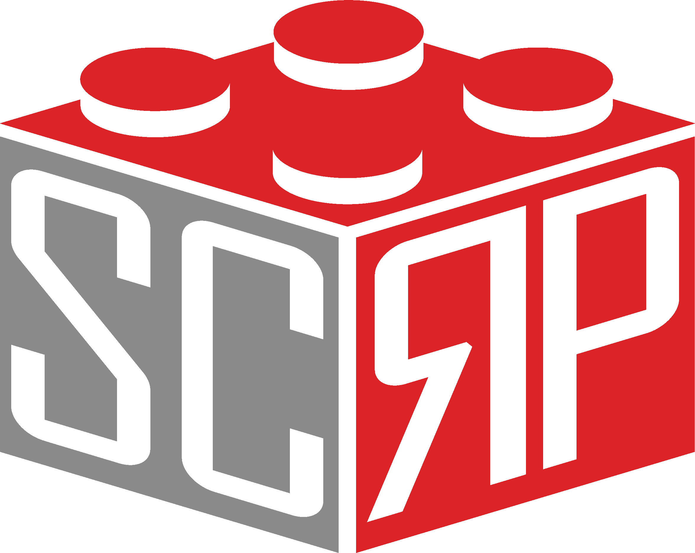

# PyGame Examples
Examples using PyGame!\

## SCRP

The Schulich Community Robotics Program (SCRP) is a club from the University of Calgary, that focuses on creating
programs to teach youth robotics, programming, problem-solving, etc. These processing examples are tied in with
the `Discover Programming 2 (DP2)` program. Along with DP2, SCRP offers a variety of different courses such as:

- Discover Programming (predecessor program)
- Discover Electronics
- First Lego League
- First Robotics Competition

### `CONTACT`
For volunteering opportunities, contact Ben or Bismarck at Volunteers@thesteamgeneration.ca for more information.\
For more information regarding workshops and joining the parent email list, contact Libby at Vp@thesteamgeneration.ca.